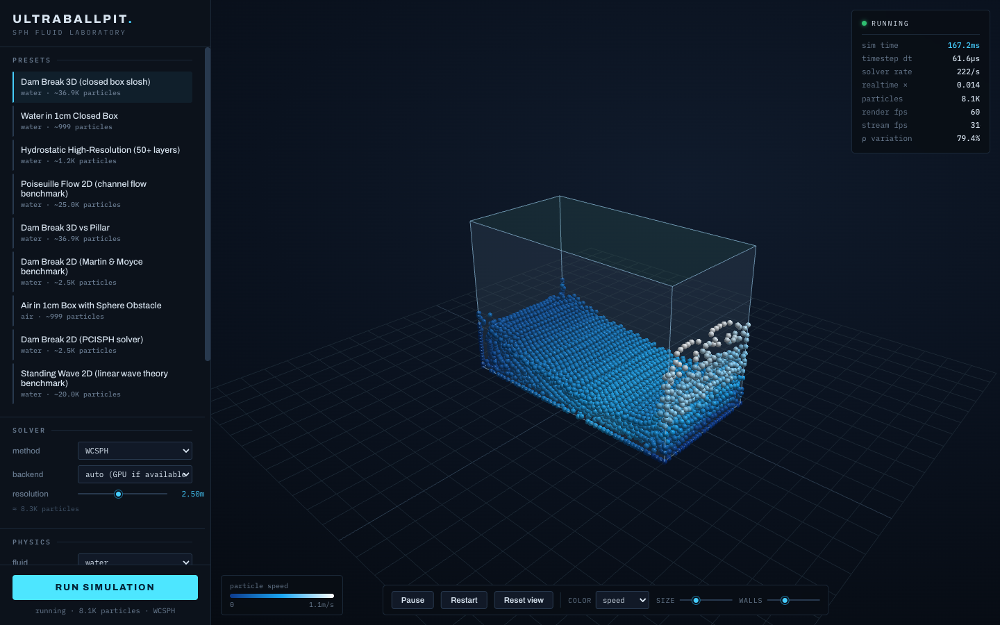
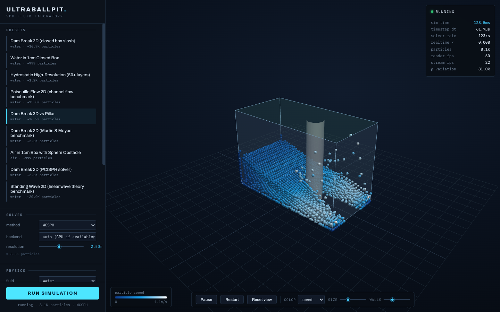

# Ultraballpit

Particle-based fluid simulation (WCSPH) around 3D STL geometry with interactive web visualization and force reporting. Built with a Rust backend and Three.js frontend.



| Wave wrapping a pillar obstacle | Splash around a UI-configured sphere |
|---|---|
|  |  |

## Quick Start

```sh
# Prerequisites: Rust, Node.js, just (command runner)

# Build everything
just build

# Start the server (serves frontend + WebSocket for live simulation)
just serve

# Run tests
just test
```

## Architecture

```
backend/
  crates/
    kernel/       # SPH compute kernel (CPU + Metal GPU backends)
    orchestrator/  # Simulation setup, SDF generation, domain config
    server/       # HTTP + WebSocket server (axum)
frontend/         # Three.js interactive visualization
configs/          # Simulation configuration files (JSON)
geometries/       # STL geometry files
```

**Simulation method:** Weakly Compressible SPH (WCSPH) with Wendland C2 kernel, Tait equation of state, Monaghan artificial viscosity, and velocity Verlet (kick-drift-kick) time integration.

**GPU acceleration:** Metal compute shaders via wgpu with verified CPU/GPU parity (position error < 5e-7 over 100 steps).

## What's Implemented

- **SPH kernel** with adaptive timestep (CFL condition), uniform grid neighbor search, SDF-based boundary handling
- **CPU and GPU (Metal) backends** with identical physics
- **Orchestrator** for STL-to-SDF geometry pipeline, domain setup, simulation config
- **HTTP server** with WebSocket streaming of full particle state (positions + velocities, 30 fps), GPU-backed simulation runner, inline config API, obstacle mesh endpoint
- **Three.js frontend**: sphere-shaded particles at physical size with speed/density/temperature color modes, boundary-condition-coded container rendering, editable parameter panel (solver, resolution, gravity, domain size, per-wall BCs, fluid fill region, procedural obstacles), live telemetry HUD (dt, steps/s, realtime factor)
- **Force extraction** (pressure, viscous, net forces on geometry surfaces; grid-accelerated)
- **Distributed execution** infrastructure for multi-instance simulation
- **Reference test suite** (gravity settling, hydrostatic pressure, pressure equalization)
- **Validation benchmarks:**
  - Dam break vs Martin & Moyce 1952 experimental data (7.6% max error)
  - Hydrostatic pressure vs analytical solution (22% max error excluding surface)

## What's Left

- [ ] **Periodic boundary conditions** -- needed to unblock Poiseuille flow and standing wave benchmarks. Requires changes to neighbor grid (wrapped cell search) and boundary enforcement (position wrapping instead of clamping). The viewer badges these presets as unsupported.
- [ ] **GPU air support** -- the WGSL shaders carry air EOS constants but air simulations produce NaN within a few steps (no GPU test coverage for air). `create_kernel` currently forces the CPU backend whenever air particles are present.
- [ ] **Multiphase (Mixed water+air)** -- unstable even on CPU: air particles at the interface read huge densities from water-mass neighbors and the instability detector auto-pauses immediately. Needs a multiphase density/pressure formulation.
- [ ] **Phase change model** -- liquid/gas transition with energy tracking and tabulated saturation properties (IAPWS-IF97 steam tables). Each particle carries temperature and phase state.
- [ ] **Thermal model** -- temperature tracking, heat transfer between particles, thermal flux computation at geometry surfaces.
- [ ] **GPU-accelerated benchmarks** -- re-run validation benchmarks using the GPU kernel for performance comparison.

## Running Benchmarks

```sh
# Quick tests (~seconds)
just test

# Full validation benchmarks (~15 min, release mode)
just test-benchmarks

# GPU tests (requires Metal-capable GPU)
cd backend && cargo test --features gpu -p kernel --test gpu_cpu_parity
cd backend && cargo test --features gpu -p reference-tests -- gpu_tests
```

See [`specs/001-sph-fluid-sim/benchmark-results.md`](specs/001-sph-fluid-sim/benchmark-results.md) for detailed benchmark results.

## Diagnostics

Standalone GPU diagnostic examples (require a Metal-capable GPU):

```sh
# Print the GPU adapter's features and compute limits
cargo run --release -p kernel --example gpu_features --features gpu

# Per-pass GPU step timing for an obstacle vs obstacle-free dam break
# (grid build / density / boundary pressure / forces / integrate / readback).
# Useful for telling whether a slow scene is GPU-bound or CPU-bound: the SPH
# step is the same with or without an obstacle, so obstacle slowdowns are
# almost always in the runner's per-batch CPU work, not the kernel.
cargo run --release -p orchestrator --example profile_obstacle --features gpu
```
